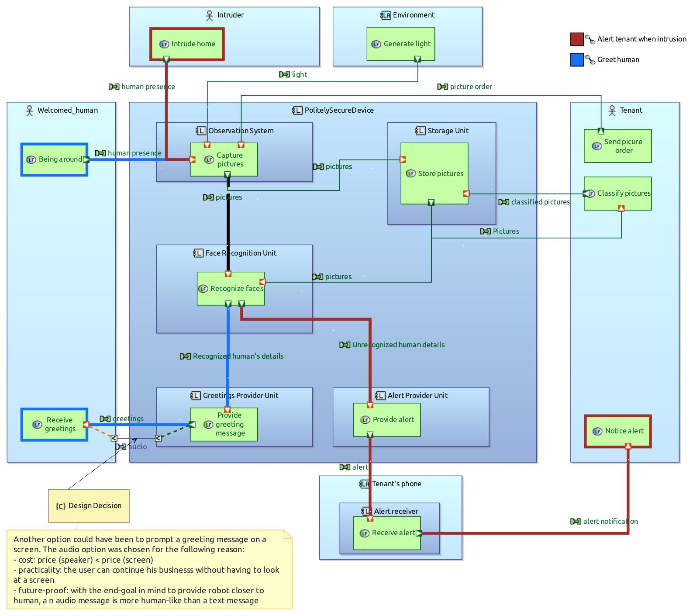
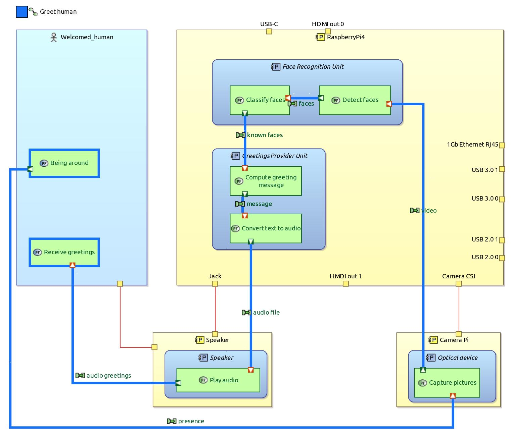

# PolitelySecureDevice

Device that greets recognized faces and can alert the tenant on intrusion. The architecture is designed with Capella; implementation runs on Raspberry Pi with a camera and speaker.

## Quickstart
- Install Python deps: `pip install -r requirements.txt`
- Set email env vars for alerts:
  - `ALERT_SENDER_EMAIL`
  - `ALERT_EMAIL_PASSWORD`
  - `ALERT_RECEIVER_EMAIL`
- Train encodings (writes `facial_recognition/encodings.pickle`): `python -m facial_recognition.training`
- Run recognition + greeting loop: `python -m facial_recognition.app`
- Capture new headshots (PiCamera): `python -m facial_recognition.capture` (press Space to save, Esc to quit)

## Module layout
- `facial_recognition/app.py`: main recognition + greeting loop
- `facial_recognition/recognition.py`: face detection/recognition engine
- `facial_recognition/training.py`: build and persist face encodings
- `facial_recognition/capture.py`: collect training headshots from PiCamera
- `facial_recognition/speech.py`: text-to-speech greetings
- `facial_recognition/alerts.py` & `email_settings.py`: email alert client + env-driven credentials
- `facial_recognition/constants.py`: shared runtime constants (encoding path, labels)

## Requirements
- Capella 5.2.0 (to open the system model)
- Raspberry Pi 4 with camera and audio output (for runtime)

## System Model
### Logical Architecture
The Logical Architecture describes the main architectural concepts. On the diagram below, the high-level architectural components and their functionalities are presented. Some design decisions are also made such as the choice of an audio message rather than a text message to greet people.

### Physical Architecture
The Physical Architecture describes the technological choices. Here we will make use of a RaspberryPi 4 and a camera to detect and recognize faces.

#### Implementation of "Greeting"

#### Implementation of "Alert tenant"

