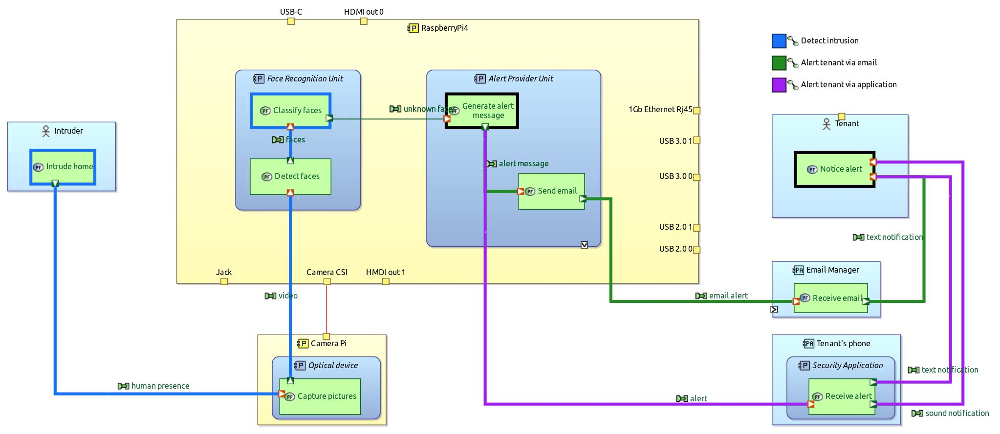

# PolitelySecureDevice

The goal is to develop a device greeting people around based on face recognition. A later version will include the capability to alert the owner/tenant when there is intrusion.  
The development is conducted using a Model-Based System Engineering approach on the software [Capella](https://www.eclipse.org/capella/) to support the elicitation of the system needs and the design of an appropriate architecture.

## System Model
### Logical Architecture
The Logical Architecture describes the main architectural concepts. On the diagram below, the high-level architectural components and their functionalities are presented. Some design decisions are also made such as the choice of an audio message rather than a text message to greet people.

### Physical Archtitecture
The Physical Architecture describes the technological choices. Here we will make use of a RaspberryPi 4 and a camera to detect and recognize faces.

#### Implementation of "Greeting"

#### Implementation of "Alert tenant"

